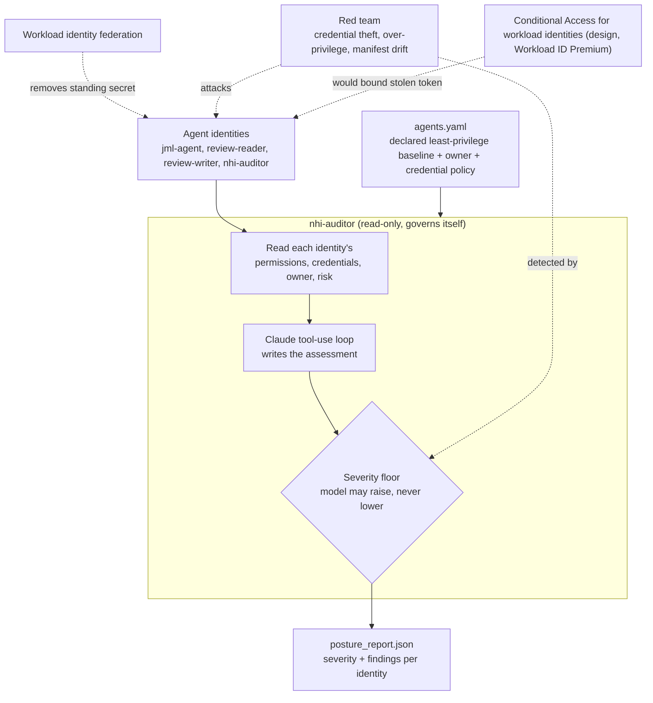

# Secure the Agent: Non-Human Identity Hardening for Autonomous Agents

This project inverts the rest of the portfolio. Projects 01 and 02 are agents that do IAM work and happen to be secured. Here the agent identities themselves are the subject: an autonomous agent that can act on a directory is a privileged non-human identity, and this builds the security program it should have, plus an agent that audits that posture. It proves a declared least-privilege baseline, kills the standing secret with workload identity federation, enforces an accountable owner and zero standing privilege, and red-teams the agent identity itself.

## Overview

Enterprises spent 2025 adopting AI agents and are spending 2026 discovering they adopted a population of unmanaged privileged identities. Industry surveys put over-permissioned non-human identities and the absence of any policy for creating or removing agent identities at the top of the 2026 pain list. An agent with standing access to a directory is a superuser with no user behind it, no second factor, and often a long-lived secret sitting in a vault. The manual process fails because nobody owns the inventory: agents are created as service principals by whoever needed one, with broad scopes, no expiry discipline, and no accountable human.

This project treats the agent identities built in projects 01 and 02 as exactly that population and governs them. A manifest declares each identity's purpose, owner, allowed Microsoft Graph permissions, and credential policy, and becomes the source of truth. A read-only posture auditor reads each identity's live configuration and grades it against the manifest, with a deterministic severity floor so a critical finding cannot be explained away. The standing client secret is replaced with workload identity federation, so the automated runtime holds only a short-lived token and there is nothing long-lived to steal. The auditor is itself a non-human identity, so it appears in its own manifest and grades its own posture: a governance tool that is not governed by its own rules is the first thing an attacker turns.

Three design decisions carry the security story, each chosen over the simpler alternative:

| Decision | Chosen approach | Rejected alternative | Why |
| :--- | :--- | :--- | :--- |
| Agent authentication | Workload identity federation, no stored secret for the automated path | A long-lived client secret in a vault | A stored secret is a standing, stealable, replayable credential. Federation leaves nothing long-lived to exfiltrate. |
| Least privilege | A declared manifest the auditor grades against, flagging any scope beyond it as drift | Point-in-time manual review of app permissions | A manifest is a live control. Drift is detected automatically, not during an annual review nobody runs. |
| The auditor's own power | Read-only, and governed by its own manifest entry | A read-write tool that can remediate what it finds | The identity that can read every NHI's configuration is a prime target, so it must not be able to change what it inspects. |

## Architecture

## Key Concepts Demonstrated

- **Agent as a privileged non-human identity**: the agents from projects 01 and 02 are governed as the NHI population they are.
- **Governance-as-code**: a manifest is the declared least-privilege baseline, and drift from it is a detectable finding.
- **Kill the standing secret**: workload identity federation removes the long-lived credential for the automated runtime.
- **Deterministic severity floor**: critical findings (over-privilege drift, risky service principal, missing owner) are set in code and the model can only raise them.
- **Accountability and zero standing privilege**: every agent identity has an owner, and privileged actions stay PIM-eligible rather than standing.
- **The auditor governs itself**: the read-only auditor appears in its own manifest and grades its own posture.

## Skills Demonstrated

- **Non-human identity security**: service principal and app registration governance, credential hygiene, workload identity federation, and service-principal risk.
- **Microsoft Graph**: `applications`, `servicePrincipals`, `appRoleAssignments`, `federatedIdentityCredentials`, owners, and `identityProtection/riskyServicePrincipals`.
- **Agentic AI engineering**: a bounded Claude tool-use loop with a severity floor the model cannot soften.
- **Secure CI**: OIDC-based workload identity federation in GitHub Actions, authenticating with no stored secret.
- **Security testing**: a credential-theft blast-radius case, an over-privilege scope probe, and a manifest-drift detection test.

## Walkthrough

<strong>Phase 1: Declare the identity manifest (governance-as-code)</strong>

`manifest/agents.yaml` declares every agent identity: purpose, accountable owner, allowed Graph permissions, credential policy, and whether standing directory roles are permitted. This is the source of truth the auditor grades against.

<strong>Phase 2: The auditor's own least-privilege identity</strong>

`nhi-auditor` was registered read-only and admin-consented to `Application.Read.All`, `Directory.Read.All`, `AuditLog.Read.All`, and `IdentityRiskyServicePrincipal.Read.All`. The identity that reads every other identity's configuration holds no write permission.

<strong>Phase 3 to 5: Reader tools and the severity floor</strong>

`iam_tools/graph_client.py` authenticates the auditor (client secret locally, federated assertion in CI) and is read-only. `iam_tools/nhi_reader.py` gathers each identity's granted permissions (resolving the appRole GUIDs back to names against Microsoft Graph's own app roles), credentials and expiry, federated credentials, owners, and service-principal risk. `iam_tools/severity.py` sets the deterministic severity for each finding.

<strong>Phase 6: The posture auditor agent</strong>

`auditor/posture_agent.py` runs a bounded tool-use loop per identity: the model writes a plain-language assessment, then code applies the deterministic findings and severity floor. The output is `posture_report.json`, one graded entry per identity, including the auditor grading itself.

<strong>Phase 7: Kill the standing secret (workload identity federation)</strong>

A federated credential was configured on an agent's app registration trusting GitHub Actions OIDC, and a CI run authenticated to Graph with no stored secret. The client secret was then removed, and the posture auditor's "standing client secret present" finding cleared. See `federation/setup-federation.md`.

<strong>Phase 8: Zero standing privilege and sponsor accountability</strong>

Each agent identity has a named owner, which the auditor flags as HIGH when missing, mirroring the sponsor concept in Entra Agent ID. No agent holds a standing directory role; the privileged path stays PIM-eligible as built in project 01.

<strong>Phase 9: Monitoring and detection</strong>

The auditor reads each identity's service-principal risk and sign-in activity. If sign-in and audit logs are exported to a Log Analytics workspace, a KQL detection flags anomalous service-principal behavior, tying prevention to detection.

<strong>Phase 10: Red team the agent identity</strong>

The read-only auditor was refused when it tried to write a credential, proving it cannot tamper with what it inspects. A credential-theft case shows the blast radius of a leaked standing secret and how federation removes it. A scope granted beyond the manifest was flagged CRITICAL as drift. Full write-up in `redteam/findings.md`.

<strong>Phase 11: Governance layer and honest caveats</strong>

The manifest and owner model are a hand-built version of Entra Agent ID's agent identities and sponsors; the full platform's agent-security features need M365 Agent or E7 licensing beyond this tenant's P2. Conditional Access for workload identities (block the agent's sign-in outside known IP ranges, refuse on service-principal risk) and access reviews of service principals both need Workload Identities Premium, so they are documented as design recommendations rather than executed.

## Lessons Learned

- **A stored secret is a standing liability.** Moving the agent's automated runtime to workload identity federation removed the single most stealable thing it had. The clearest security win in the whole portfolio was deleting a credential, not adding a control.
- **A manifest turns least privilege into a live control.** Declaring the allowed scopes made privilege drift a detectable finding instead of something you would catch in an annual review, if ever.
- **Govern the tool that governs everything.** The auditor reads every non-human identity's configuration, so it is read-only and appears in its own manifest. A posture tool that can change what it inspects, or that exempts itself, is an escalation path.

### How This Fails In Production

- **Conditional Access for workload identities is not applied.** It needs Workload Identities Premium, so binding the agent's token to known IP ranges and refusing it on service-principal risk is a documented design step, not a live control here.
- **Entra Agent ID is the real destination.** The manifest and owner model approximate agent identities and sponsors; the first-class platform needs M365 Agent or E7 licensing.
- **The auditor cannot remediate.** It is read-only by design, so findings are reported, not fixed. A production split would pair it with a separate, tightly-scoped remediation identity behind human approval, never one tool that both reads everything and writes everything.
- **Service-principal sign-in activity is a beta Graph endpoint.** Staleness detection depends on it, so it is read from `/beta` and may change.
- **Federation covers the automated path, not interactive dev.** Local development still acquires a short-lived token another way, so the honest claim is no standing secret for the automated runtime, not no credentials anywhere.
