# Secure the Agent: Non-Human Identity Hardening for Autonomous Agents

This project inverts the rest of the portfolio. Projects 01 and 02 are agents that do IAM work and happen to be secured. Here the agent identities themselves are the subject: an autonomous agent that can act on a directory is a privileged non-human identity, and this builds the security program it should have, plus an agent that audits that posture. It declares a least-privilege baseline as code, catches real privilege drift, kills the standing secret with workload identity federation, enforces an accountable owner, and red-teams the agent identity itself.

## Overview

Enterprises spent 2025 adopting AI agents and are spending 2026 discovering they adopted a population of unmanaged privileged identities. Industry surveys put over-permissioned non-human identities and the absence of any policy for creating or removing agent identities at the top of the 2026 pain list. An agent with standing access to a directory is a superuser with no user behind it, no second factor, and often a long-lived secret sitting in a vault. The manual process fails because nobody owns the inventory: agents are created as service principals by whoever needed one, with broad scopes, no expiry discipline, and no accountable human.

This project treats the agent identities built in projects 01 and 02 as exactly that population and governs them. A manifest declares each identity's purpose, owner, allowed Microsoft Graph permissions, and credential policy, and becomes the source of truth. A read-only posture auditor reads each identity's live configuration and grades it against the manifest, with a deterministic severity floor so a critical finding cannot be explained away. The standing client secret is replaced with workload identity federation, so the automated runtime holds only a short-lived token and there is nothing long-lived to steal. The auditor is itself a non-human identity, so it appears in its own manifest and grades its own posture: a governance tool that is not governed by its own rules is the first thing an attacker turns.

The strongest evidence it works came for free: on its first run the auditor flagged `jml-agent` as CRITICAL for holding `Group.ReadWrite.All`, a scope not in its manifest. That was not a planted test. Project 01 deliberately chose the narrower `GroupMember.ReadWrite.All`, and its own README flagged `Group.ReadWrite.All` as broader than needed, yet the grant was still present in the tenant. The auditor caught a real over-privilege, which was then remediated in Entra and the re-run came back clean.

Three design decisions carry the security story, each chosen over the simpler alternative:

| Decision | Chosen approach | Rejected alternative | Why |
| :--- | :--- | :--- | :--- |
| Agent authentication | Workload identity federation, no stored secret for the automated path | A long-lived client secret in a vault | A stored secret is a standing, stealable, replayable credential. Federation leaves nothing long-lived to exfiltrate. |
| Least privilege | A declared manifest the auditor grades against, flagging any scope beyond it as drift | Point-in-time manual review of app permissions | A manifest is a live control. Drift is detected automatically, as the real `Group.ReadWrite.All` catch showed. |
| The auditor's own power | Read-only, and governed by its own manifest entry | A read-write tool that can remediate what it finds | The identity that can read every NHI's configuration is a prime target, so it must not be able to change what it inspects. |

## Architecture

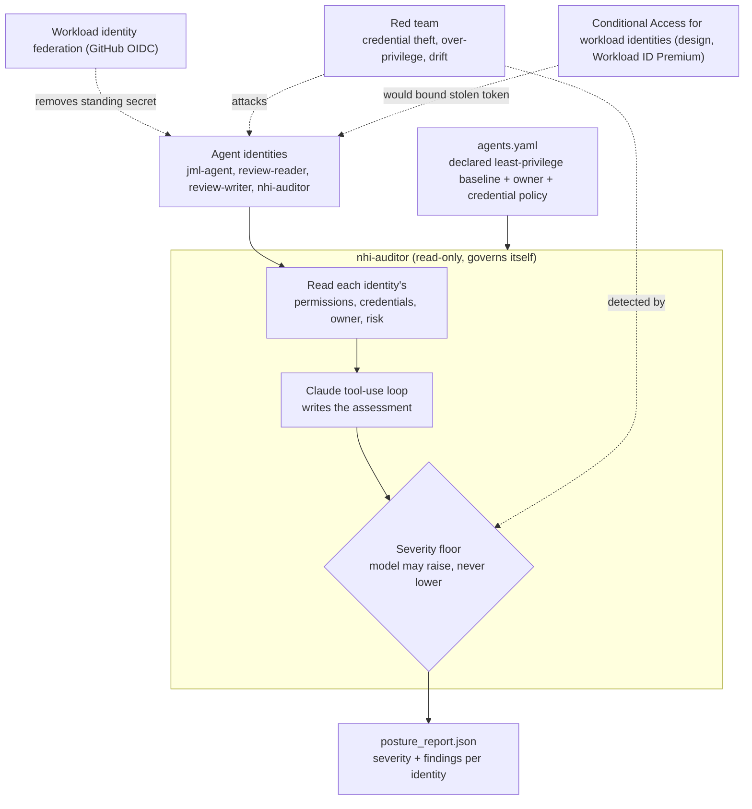

## Key Concepts Demonstrated

- **Agent as a privileged non-human identity**: the agents from projects 01 and 02 are governed as the NHI population they are.
- **Governance-as-code catches real drift**: a manifest is the declared baseline, and the auditor flagged a genuine over-grant (`Group.ReadWrite.All` on `jml-agent`) that was then remediated.
- **Kill the standing secret**: workload identity federation via GitHub Actions OIDC removes the long-lived credential for the automated runtime.
- **Deterministic severity floor**: critical findings (over-privilege drift, risky service principal, missing owner) are set in code and the model can only raise them.
- **Accountability and zero standing privilege**: every agent identity has an owner, and none hold a standing directory role.
- **The auditor governs itself**: the read-only auditor appears in its own manifest and grades its own posture.

## Skills Demonstrated

- **Non-human identity security**: service principal and app registration governance, credential hygiene, workload identity federation, and service-principal risk.
- **Microsoft Graph**: `applications`, `servicePrincipals`, `appRoleAssignments` (with appRole GUID-to-name resolution), `federatedIdentityCredentials`, owners, `identityProtection/riskyServicePrincipals`, and the beta service-principal sign-in report.
- **Agentic AI engineering**: a bounded Claude tool-use loop with a severity floor the model cannot soften.
- **Secure CI**: OIDC-based workload identity federation in GitHub Actions, authenticating with no stored secret.
- **Security testing**: a credential-theft blast-radius case, an over-privilege scope probe, and real privilege-drift detection.

## Walkthrough

<strong>Phase 1 and 2: Manifest and the auditor's own least-privilege identity</strong>

`manifest/agents.yaml` declares every agent identity: purpose, accountable owner, allowed Graph permissions, credential policy, and whether standing directory roles are permitted. `nhi-auditor` was then registered read-only and admin-consented to exactly four scopes: `Application.Read.All`, `Directory.Read.All`, `AuditLog.Read.All`, and `IdentityRiskyServicePrincipal.Read.All`. The identity that reads every other identity's configuration holds no write permission.

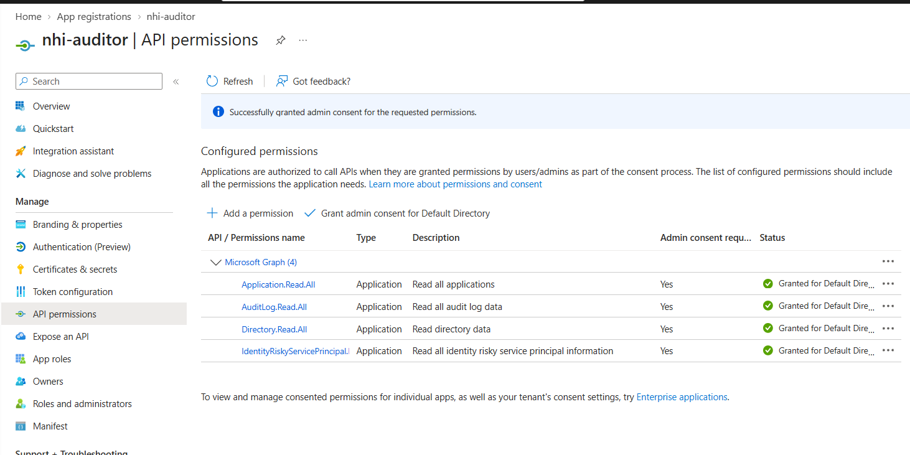

<strong>Phase 3 to 5: Reader tools and the severity floor</strong>

`iam_tools/graph_client.py` authenticates the auditor (a client secret locally, a federated assertion in CI) and is read-only. A smoke test confirms it can read applications. `iam_tools/nhi_reader.py` gathers each identity's granted permissions, resolving the appRole GUIDs back to names against Microsoft Graph's own app roles, plus credentials and expiry, federated credentials, owners, and service-principal risk. `iam_tools/severity.py` sets the deterministic severity for each finding.

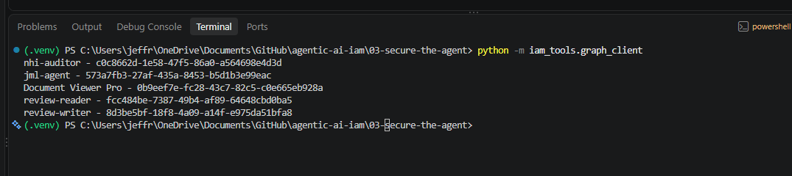

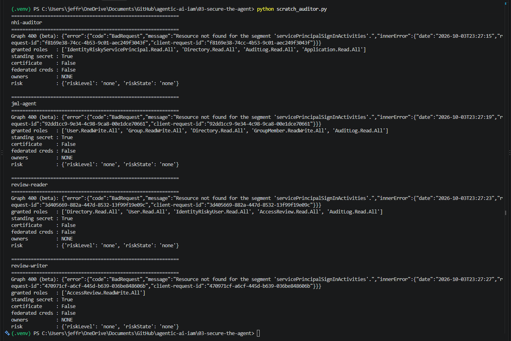

<strong>Phase 6: The posture auditor agent</strong>

`auditor/posture_agent.py` runs a bounded tool-use loop per identity: the model writes a plain-language assessment, then code applies the deterministic findings and severity floor. The first run is the before-state baseline, and it earned its keep immediately: `jml-agent` came back CRITICAL for a real over-privilege (`Group.ReadWrite.All`, not in its manifest), every identity was flagged for a standing secret and a credential older than the 90-day policy, and all were missing an owner.

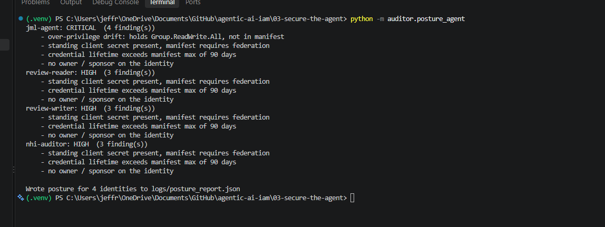

<strong>Phase 7: Kill the standing secret (workload identity federation)</strong>

A federated credential was configured on `nhi-auditor` trusting GitHub Actions OIDC, and a CI workflow authenticated to Microsoft Graph with no stored secret: the job minted a short-lived OIDC token, exchanged it for a Graph token, and read applications as the auditor. The workflow run log states it plainly: "Federation succeeded: obtained a Graph token with no stored secret."

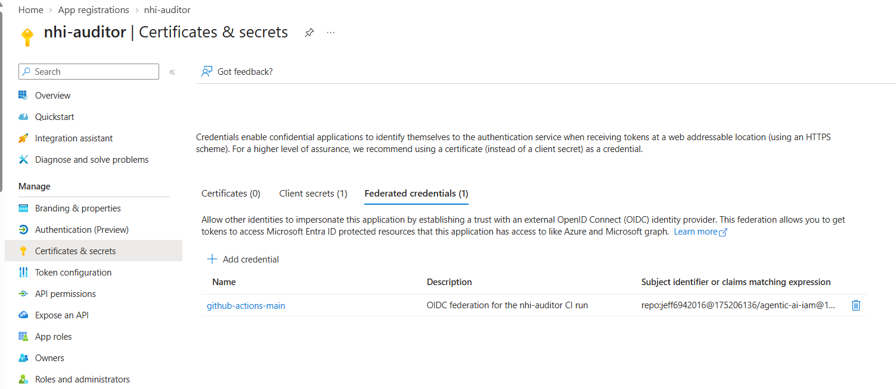

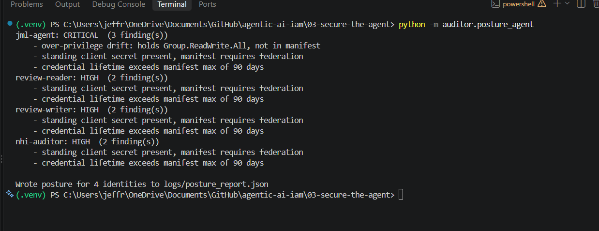

Honest state: federation proves the automated path is secret-less, but the standing client secret was kept for local development, so the auditor still reports it present. Deleting it is the final step to clear that finding, and the auditor correctly flags it until then.

<strong>Phase 8: Zero standing privilege and sponsor accountability</strong>

An owner was added to each agent app registration, which the auditor had flagged as HIGH when missing, mirroring the sponsor concept in Entra Agent ID. A Graph query confirmed no agent service principal holds a standing directory role, and the privileged path from project 01 stays PIM-eligible. After adding owners and remediating the `Group.ReadWrite.All` drift, the re-run dropped from CRITICAL to a clean set of HIGH findings, the remaining ones being the standing secret (federation addresses it) and credential age.

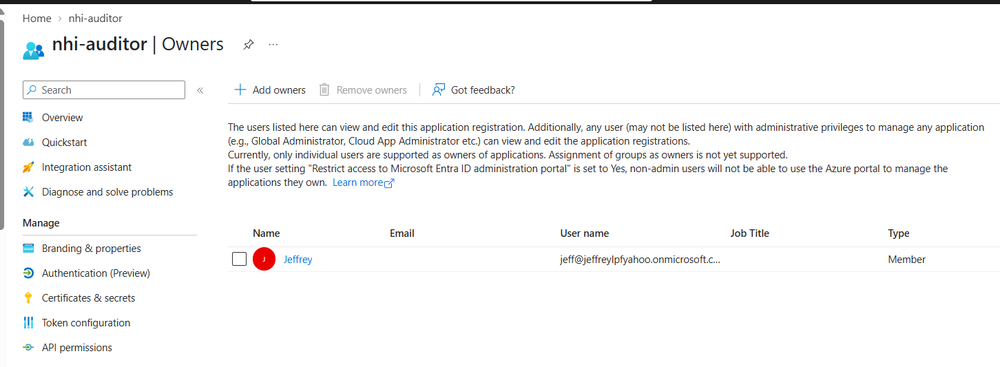

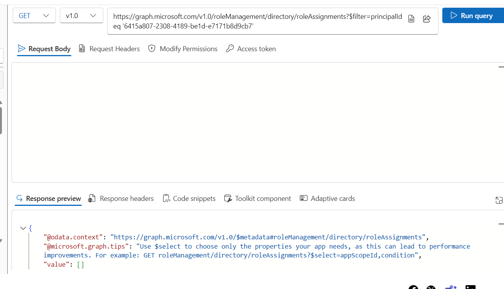

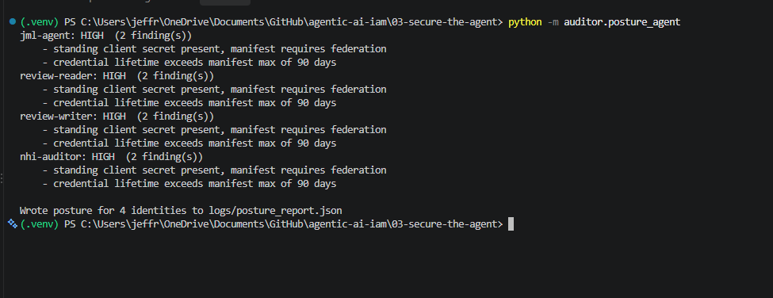

<strong>Phase 9: Monitoring and detection</strong>

Each agent's service-principal sign-ins are visible in Entra, and sign-in logs exported to a Log Analytics workspace make anomalous behavior queryable. A KQL detection over `AADServicePrincipalSignInLogs` flags any agent authenticating from more than one distinct IP, exactly the signal Conditional Access for workload identities would act on. The auditor also reads each identity's service-principal risk, which came back with no risk record for these accounts.

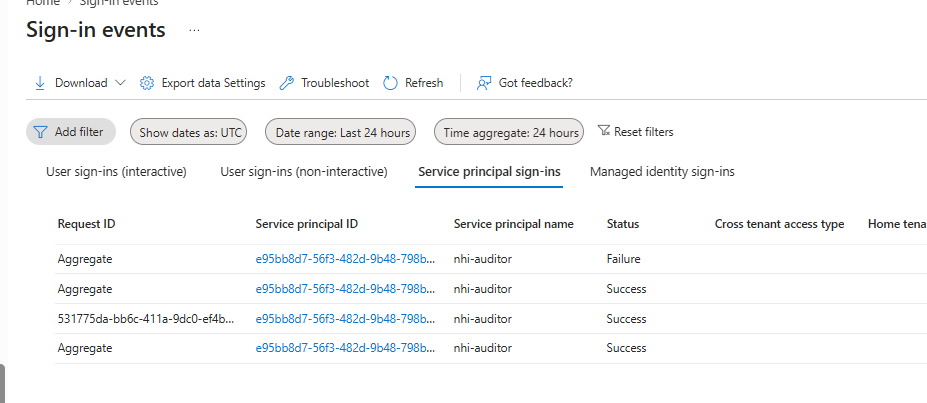

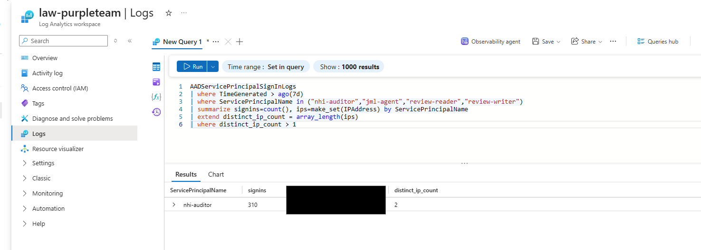

<strong>Phase 10: Red team the agent identity</strong>

The read-only auditor was refused with a 403 when it tried to add a credential to an application, proving it cannot tamper with what it inspects. A credential-theft case shows the blast radius of a leaked standing secret and how federation removes it. And the real `Group.ReadWrite.All` over-grant on `jml-agent` was the drift case: the auditor flagged it CRITICAL, it was removed in Entra, and the finding cleared. Full write-up in `redteam/findings.md`.

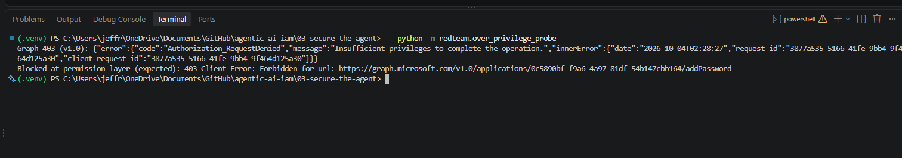

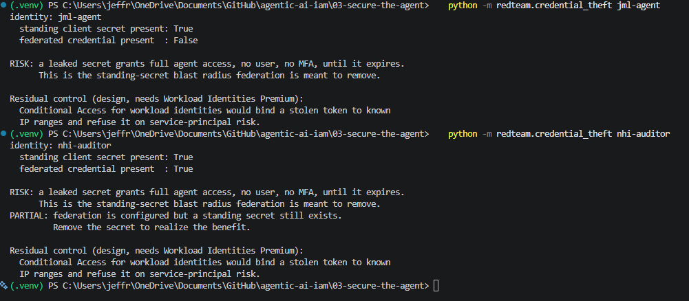

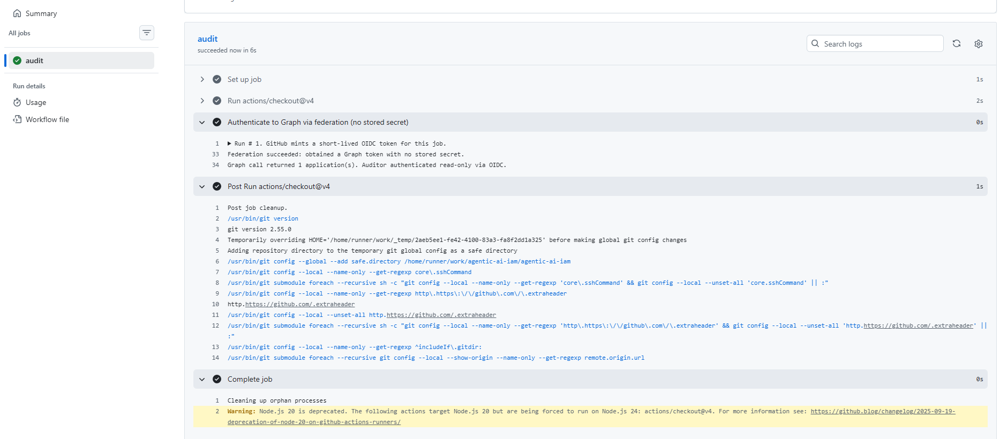

<strong>Phase 11: Governance layer and honest caveats</strong>

The manifest and owner model are a hand-built version of Entra Agent ID's agent identities and sponsors; the full platform's agent-security features need M365 Agent or E7 licensing beyond this tenant's P2. Conditional Access for workload identities (block the agent's sign-in outside known IP ranges, refuse on service-principal risk) and access reviews of service principals both need Workload Identities Premium, so they are documented as design recommendations rather than executed.

## Lessons Learned

- **The auditor caught a real over-grant, not a staged one.** Its best moment was unscripted: it flagged `Group.ReadWrite.All` on `jml-agent`, a scope project 01 had explicitly decided against and even flagged in its own README, yet the grant was live in the tenant. A declared manifest turned that latent drift into a CRITICAL finding, and remediation closed it. That is the whole argument for governance-as-code in one example.
- **A stored secret is a standing liability.** Moving the auditor's automated runtime to workload identity federation removed the single most stealable thing it had. The CI run proving a secret-less authentication was a stronger result than any added control.
- **Govern the tool that governs everything.** The auditor reads every non-human identity's configuration, so it is read-only and appears in its own manifest. A posture tool that can change what it inspects, or that exempts itself, is an escalation path.

### How This Fails In Production

- **The standing secret is configured away, not yet deleted.** Federation proves the automated path needs no secret, but a client secret was kept for local development, so the auditor still reports it. In production the dev path would also move off secrets and the credential would be removed entirely.
- **Conditional Access for workload identities is not applied.** It needs Workload Identities Premium, so binding the agent's token to known IP ranges and refusing it on service-principal risk is a documented design step, not a live control here.
- **The beta sign-in endpoint is unreliable.** `servicePrincipalSignInActivities` returned errors in this tenant, so the code degrades to None and monitoring was done through the Entra portal and a Log Analytics KQL query instead. Staleness detection depends on that beta endpoint and may not be available everywhere.
- **The auditor cannot remediate.** It is read-only by design, so findings are reported, not fixed. A production split would pair it with a separate, tightly-scoped remediation identity behind human approval, never one tool that both reads everything and writes everything.
- **Service-principal risk was empty.** Identity Protection had no risk record for these lab accounts, so the risk signal was present in the pipeline but never exercised against a genuinely risky principal.
