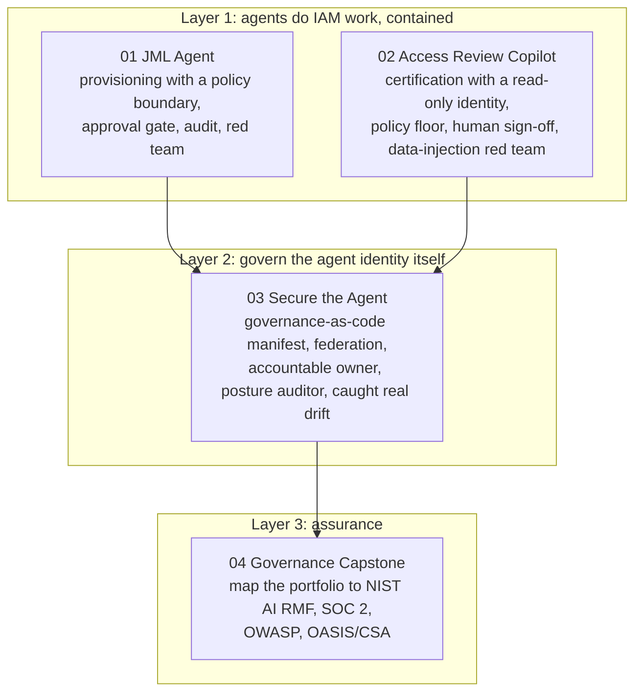

# Governance Capstone: Mapping the Agentic IAM Portfolio to Recognized Frameworks

This capstone ties the three preceding projects into one story and grades them against the controls an auditor and an enterprise security team would recognize. The thesis across the portfolio is a single security posture, not a set of demos: an autonomous agent that can act on a directory is a new class of privileged non-human identity, and every project scopes, gates, audits, and red-teams it as one. This document maps that work to NIST AI RMF, SOC 2 CC6, the OWASP guidance on LLM and agentic and non-human-identity risk, and the 2026 agentic-identity guidance from OASIS and CSA.

## The three-layer story

The portfolio is deliberately not three disconnected repos. It is one arc: use agents to solve real IAM pain, recognize that the agent itself is a risk, and govern it against real frameworks.

## Control coverage across the portfolio

Each capability below is a control a security reviewer looks for, and the columns show where it is demonstrated. The point is coverage across prevention, detection, and governance, not a single clever trick.

| Control | 01 JML | 02 Review | 03 Secure | How it shows up |
| :--- | :---: | :---: | :---: | :--- |
| Least privilege on the agent identity | yes | yes | yes | Minimal Graph scopes per identity; 03's manifest makes it a declared baseline |
| Policy boundary the model cannot cross | yes | yes | yes | Roles from policy, not model choice; severity and verdict floors enforced in code |
| Human-in-the-loop for privileged action | yes | yes | n/a | Approval gate for privileged groups (01); decisions recorded only after sign-off (02) |
| Zero standing privilege | yes | n/a | yes | PIM-eligible privileged path (01); no standing directory roles on agents (03) |
| Credential hygiene / no standing secret | n/a | n/a | yes | Workload identity federation removes the standing secret (03) |
| Separation of duties by identity | n/a | yes | yes | Read-only vs write-scoped identities (02); read-only auditor that cannot change what it inspects (03) |
| Full attribution logging | yes | yes | yes | Structured audit logs tied to the acting identity, corroborated in Entra |
| Detection / monitoring | partial | yes | yes | Entra audit logs; Identity Protection risk; service-principal sign-in KQL (03) |
| Red-team validation | yes | yes | yes | Prompt injection (01), data-driven injection (02), scope probe and real drift catch (03) |
| Accountable owner / sponsor | n/a | n/a | yes | A required owner on every agent identity (03) |
| Governance-as-code | n/a | n/a | yes | A manifest as the source of truth that caught a genuine over-grant (03) |

## NIST AI RMF mapping

The AI Risk Management Framework's four functions, mapped to what the portfolio actually does.

| Function | What the portfolio does |
| :--- | :--- |
| GOVERN | Agents are treated as privileged non-human identities with a declared least-privilege manifest, an accountable owner per identity, and least privilege as a standing policy rather than a one-time setting. |
| MAP | Each project opens with a threat model that names the agent itself as the risk: an over-granting provisioner, a reviewer that reads the whole entitlement graph, an agent identity with a stealable standing secret. |
| MEASURE | The agents are tested, not assumed safe: prompt injection, data-driven injection through directory fields, read/write scope probes, and a posture auditor that graded every agent identity and caught a real over-privilege. |
| MANAGE | Risk is contained with human-in-the-loop gates, PIM-eligible privilege, workload identity federation, auto-applied review decisions, and remediation of the drift the auditor found. |

## SOC 2 CC6 mapping

The logical-access criteria an auditor applies, mapped to the portfolio.

| Criterion | Coverage |
| :--- | :--- |
| CC6.1 logical access and least privilege | Minimal, declared Graph scopes on every agent identity; the manifest in project 03 enforces the baseline. |
| CC6.2 and CC6.3 access granted, modified, and removed by role | Joiner-mover-leaver provisioning and deprovisioning by policy role (01); access certification and removal through native reviews (02). |
| CC6.6 credentials and boundary protection | Workload identity federation removes the standing secret (03); Conditional Access for the approver (02), and for workload identities as a documented design step. |
| CC6.7 restrict access to information | Read-only and write-scoped identities kept separate (02, 03) so the identity that reads everything cannot change it. |
| CC7.2 and CC7.3 detection and monitoring | Structured audit logs per acting identity, Identity Protection risk signals, and KQL detections on service-principal sign-ins. |

## OWASP mapping

| Risk area | Where it is addressed |
| :--- | :--- |
| LLM01 Prompt Injection | Resisted in 01 (malicious ticket) and 02 (hostile directory field), and backstopped by code-enforced floors so the control does not depend on the model. |
| Excessive Agency | The agents hold no scope beyond their task; 01 has no directory-role permission at all, so it structurally cannot grant admin. |
| OWASP Non-Human Identity risks (over-privilege, long-lived secrets, missing ownership) | The whole subject of project 03: drift detection, federation to kill the standing secret, and a required owner. |

## OASIS and CSA agentic-identity guidance (2026)

The 2026 guidance treats agents as first-class, accountable identities with their own lifecycle, least privilege, and auditability. The portfolio implements a hand-built version: a declared identity manifest, a sponsor per agent (the owner), least-privilege scopes, federation for credentials, and continuous posture auditing. Entra Agent ID is the first-class platform this approximates, and its gaps (agent-security licensing, Conditional Access for workload identities) are documented honestly in project 03.

## Key Concepts Demonstrated

- **One posture, not three demos**: prevention, detection, and governance across the agent lifecycle, mapped to recognized controls.
- **The security lens is the headline**: every project leads with the agent as a privileged non-human identity, which is the differentiator the frameworks reward.
- **Evidence over assertion**: the red teams and the posture auditor produced real findings, including a genuine over-grant that was remediated, rather than happy-path demos.

## Skills Demonstrated

- **Security governance and assurance**: mapping hands-on work to NIST AI RMF, SOC 2 CC6, OWASP, and the OASIS/CSA agentic-identity guidance.
- **Control design across the lifecycle**: least privilege, zero standing privilege, separation of duties, credential hygiene, attribution, detection, and red-team validation.
- **Honest risk communication**: each project documents how it would fail in production and where licensing or scope limits the lab.

## Lessons Learned

- **Framework mapping is where scattered labs become a portfolio.** The individual projects are stronger read as one arc against named controls than as three separate repos.
- **The most convincing evidence was unscripted.** The posture auditor catching a real `Group.ReadWrite.All` over-grant, which project 01 had itself flagged as too broad, is the clearest proof that governance-as-code works, and it maps cleanly to NIST AI RMF MEASURE and SOC 2 CC6.1.
- **Naming the gaps is part of the assurance.** Documenting what needs Workload Identities Premium or M365 Agent licensing, and what was configured but not fully realized, is what separates a credible security writeup from a marketing one.

